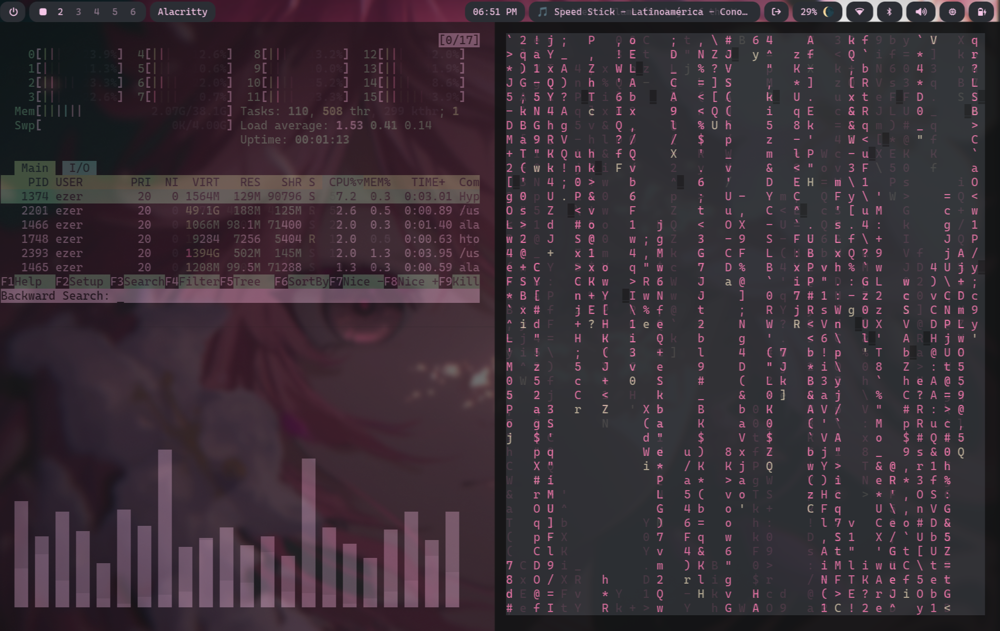
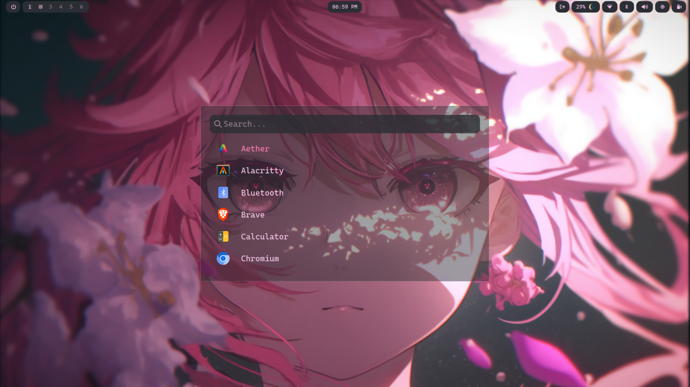
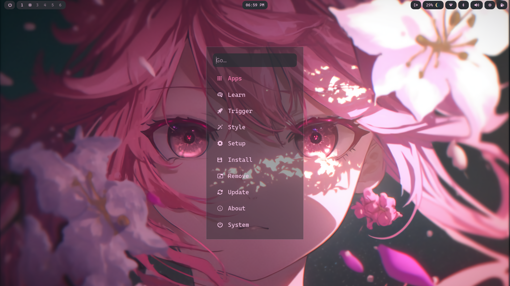

<h1>Preview</h1>



---

## [Waybar](waybar/)

---

<details>
  <summary><strong>Walker</strong></summary>

  <br>

  <a href="walker/"><strong>📁 Open Walker</strong></a>
  <p>Only <code>config.toml</code> is used.</p>

  <br><br>

  
  
</details>

---

# Omarchy Config

This repository contains my personalized **Omarchy configuration**, including themes, layout tweaks, and custom settings to enhance the look and feel of Omarchy.

✨ The goal of this setup is to maintain a **clean, consistent, and stylish UI**, with **pink accent colors 🎀** and improved usability through custom OSDs (volume, brightness, etc.).

Feel free to use this repository as a base and customize it to your own workflow.

---

## 📁 Included

- **Theme files** — custom colors and visual style
- **OSD tweaks** — volume, brightness, and other on-screen displays matching the theme
- **Configs** — organized Omarchy configuration files
- **Waybar / Walker / Wlogout** — themed UI components

---

## 🛠 Installation

If you want to use this configuration in your own Omarchy setup:

### 1️⃣ Backup your current Omarchy config (optional)

```bash
mv ~/.config/omarchy ~/.config/omarchy.backup
